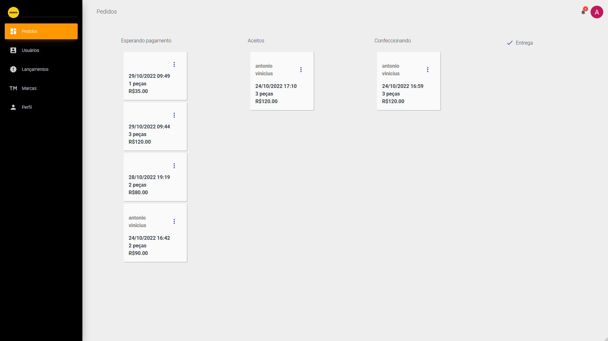
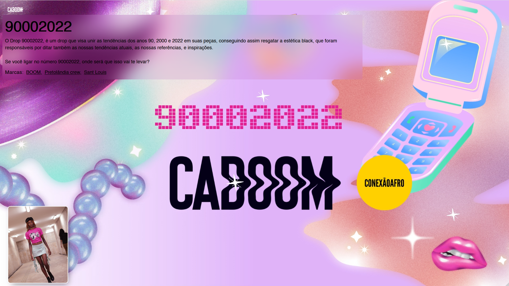
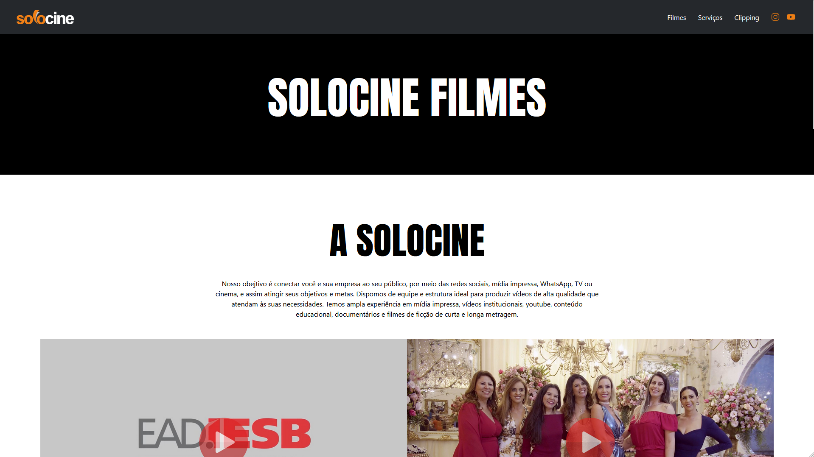
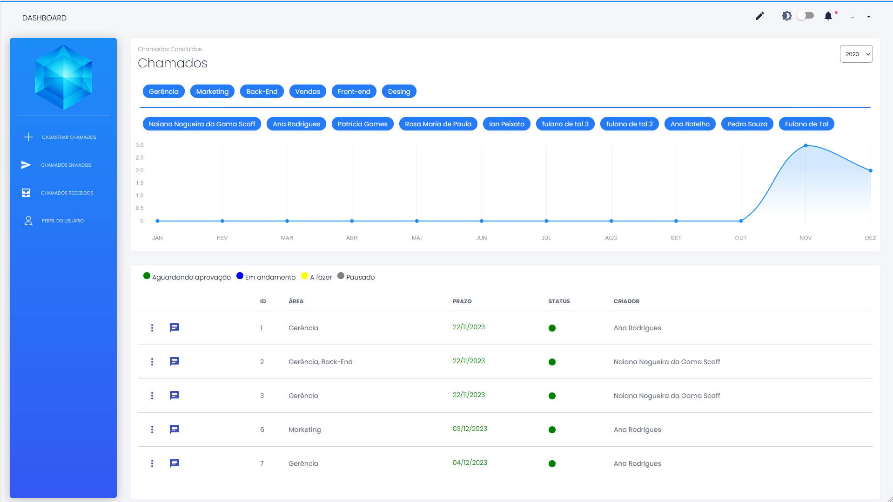

# 💻 Meus Projetos Pessoais de Desenvolvimento Web

Este repositório reúne alguns projetos pessoais que desenvolvi no início da minha carreira para praticar, testar ideias e construir soluções úteis ou interessantes. Todos os projetos estão organizados em subpastas dentro do repositório. Não pude adicionar códigos feitos profissionalmente para as empresas em que trabalhei anteriormente.

---

## 📌 Projetos

### 🔹 `Caboom - Admin`

**Descrição:**  
Plataforma feita para administrar as vendas de uma loja de roupas hipotética, contando com uma interface para gerenciamento de produtos e estoque e uma dashboard informando o desempenho das vendas. A plataforma foi construída a partir de um template que pode ser encontrado em: [Material Dashboard React](https://demos.creative-tim.com/material-dashboard-react/#/dashboard), e depois foi adaptado para suprir as necessidades da loja hipotética.

**Tecnologias:**  
React · Firebase Authentication · Firestore · Material UI

**Destaques:**
- Autenticação com e-mail e Google
- Dashboard de vendas
- Gerenciamento das informações dos produtos e estoque
- Deploy com Firebase Hosting

**Repositório:** [`./caboom/caboom-admin`](./caboom/caboom-admin)

---

### 🔹 `Caboom - Loja`

**Descrição:**  
Interface feita para promover as vendas da loja hipotética (Caboom), contando com mecanismos de carrinho de compras, login para os clientes e acompanhamento de seus pedidos.

**Tecnologias:**  
Next.js · Firebase Authentication · Firestore  · Material UI

**Destaques:**
- Interface responsiva e limpa
- Uso de NextJS para otimizar a perfomance do website em SEOs e carregamento mais rápido
- Exportação de dados em `.csv`
- Validação de formulários com React Hook Form

**Repositório:** [`./caboom/caboom-loja`](./caboom/caboom-loja)

---

### 🔹 `Solocine Produtora`

**Descrição:**  
Website feito para a produtora de audiovisual do meu pai, contendo teasers de algumas gravações que ele fez e clippings de notícias em que ele apareceu

**Tecnologias:**  
NextJS · Firebase Hosting · Tailwind CSS

**Destaques:**
- Interface responsiva e limpa
- SEO otimizado com NextJS

**Repositório:** [`./solocine`](./solocine)

---

### 🔹 `Plataforma Safira`

**Descrição:**  
Plataforma feita com o intuito de auxiliar uma empresa hipotética na gestão de tarefas e avaliação da performance da equipe por meio de uma dashboard avaliando o tempo médio de resolucao das demandas fornecidas para cada funcionário. A plataforma foi feita usando um template vindo de: [Black Dashboard React](https://demos.creative-tim.com/black-dashboard-react/#/dashboard), e adaptado para as necessidades da empresa hipotética.

**Tecnologias:**  
ReactJS · Firebase Authentication · Firebase Hosting · Material UI

**Destaques:**
- Sistema de cards para visualizacao de demandas
- Funcionalidade de chat entre os funcionarios
- Dashboard para avaliacao de desempenho dos funcionarios

**Repositório:** [`./safira`](./safira)

---

## ✍️ Autor

Desenvolvido por [Antônio Vinícius Nunes de Alencar](https://github.com/antoniovna)  

